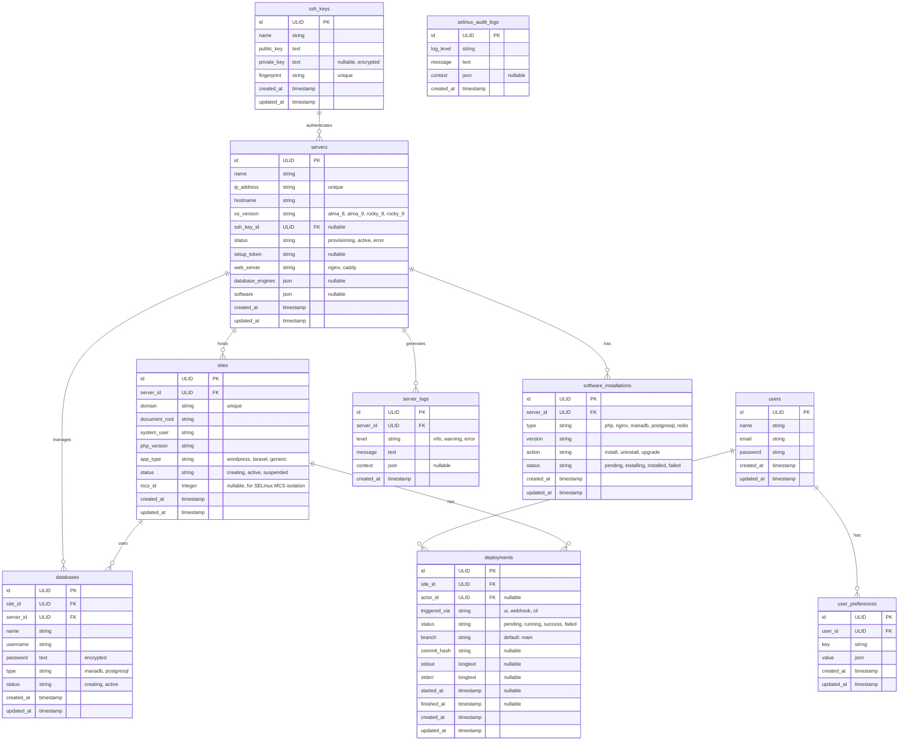
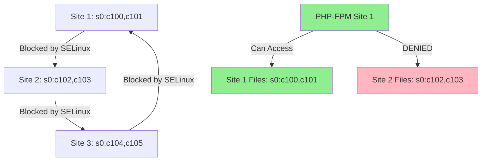
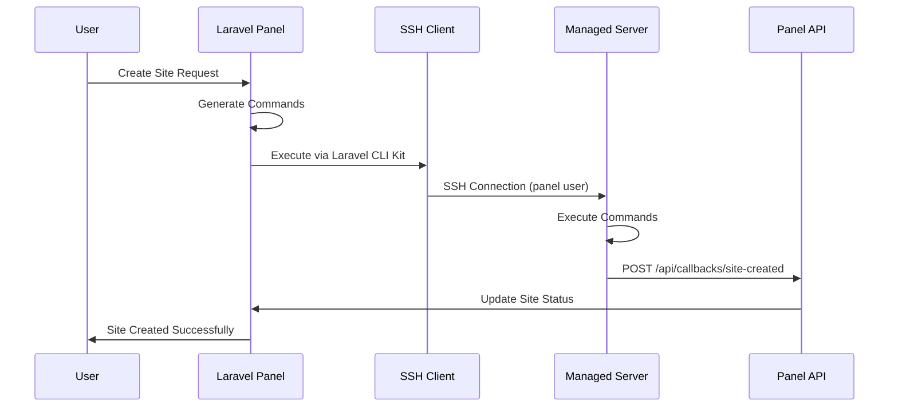
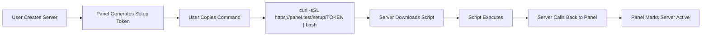
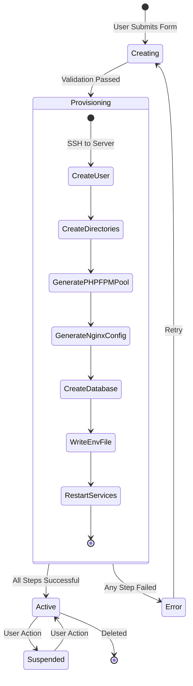

# Database & Security Architecture

## Overview

This document provides a comprehensive technical reference for the AlmaLinux/Rocky Linux Server Management Panel's database schema, SELinux security model, and panel-to-node communication patterns.

## Database Architecture

### Schema Overview

The panel uses **SQLite** as its primary database with Write-Ahead Logging (WAL) mode enabled for optimal performance. The schema is designed around ULID-based primary keys for better security and portability.

### Entity Relationship Diagram



### Key Tables

#### Core Resource Tables

**servers**
- Primary resource representing managed AlmaLinux/Rocky Linux nodes
- Uses ULID for primary keys
- Supports multiple OS versions (AlmaLinux 8/9, Rocky Linux 8/9)
- Tracks server status throughout provisioning lifecycle
- Stores web server choice (Nginx/Caddy) and installed software metadata

**sites**
- Represents individual websites hosted on servers
- Each site runs under isolated system user
- Supports multiple app types (WordPress, Laravel, Generic PHP)
- Includes `mcs_id` for SELinux Multi-Category Security isolation
- Cascade deletes when parent server is removed

**ssh_keys**
- Manages SSH authentication credentials
- Private keys are **encrypted at rest** using Laravel's `Crypt` facade (AES-256-GCM)
- Supports both generated keys and imported public keys (private_key is nullable)
- Fingerprint provides quick identification

**databases**
- Isolated database instances for each site
- Supports MariaDB and PostgreSQL
- Passwords are encrypted before storage
- Each database has dedicated user with restricted privileges

#### Audit & Logging Tables

**selinux_audit_logs**
- Captures SELinux AVC denials and policy violations
- JSON context field stores detailed violation metadata
- Critical for security monitoring and policy refinement

**server_logs**
- Tracks all server-level operations
- Structured logging with levels (info, warning, error)
- JSON context for additional metadata

#### Deployment & Software Management

**deployments**
- Tracks deployment history for sites
- Captures stdout/stderr for debugging
- Links to triggering user (actor)
- Supports multiple trigger methods (UI, webhook, CLI)

**software_installations**
- Manages software installation lifecycle on servers
- Tracks PHP versions, web servers, database engines
- Action-based tracking (install, uninstall, upgrade)

### Indexing Strategy

The schema uses the following indexing approach:

1. **Primary Keys**: All tables use ULID primary keys for better security and distributed system compatibility
2. **Foreign Keys**: All relationships use proper foreign key constraints with cascade/null behaviors
3. **Unique Constraints**: Applied to `ip_address` (servers), `domain` (sites), `fingerprint` (ssh_keys)
4. **Status Indexes**: The `deployments.status` field is indexed for efficient filtering

### SQLite Optimization

The panel database is optimized with the following pragmas (applied in `AppServiceProvider`):

```php
PRAGMA journal_mode = WAL;        // Write-Ahead Logging for concurrency
PRAGMA synchronous = NORMAL;      // Balance between safety and performance
PRAGMA cache_size = -20000;       // 20 MB cache
PRAGMA foreign_keys = ON;         // Enforce referential integrity
PRAGMA busy_timeout = 5000;       // 5 second timeout for locks
PRAGMA temp_store = MEMORY;       // Store temp tables in memory
```

## SELinux Security Architecture

### Security Model Overview

The panel implements a **SELinux-First** security model using:
- **Type Enforcement (TE)**: Custom domain types for process isolation
- **Multi-Category Security (MCS)**: Per-site isolation using unique category pairs
- **File Contexts**: Automatic labeling of panel and site directories

### SELinux Domain Types

The following custom domain types are defined in `panel.te`:

| Domain Type | Purpose | Key Permissions |
|-------------|---------|-----------------|
| `laravel_app_t` | Main panel application processes | Manage users (conditional), reload services (conditional) |
| `laravel_php_fpm_t` | PHP-FPM pool workers for sites | Read/write app directories, connect to databases (3306, 5432) |
| `laravel_nginx_t` | Nginx web server processes | Read site content, connect to PHP-FPM sockets |
| `laravel_ssh_key_t` | SSH key management daemon | Execute remote commands with proper context |
| `site_content_t` | Web-accessible site files | Read-only for web servers |
| `laravel_app_rw_t` | Writable app directories (storage, cache) | Read/write for PHP-FPM |

### SELinux Boolean Toggles

The policy includes conditional permissions controlled by booleans:

- **`panel_can_manage_users`**: Allows the panel to create/modify system users
- **`panel_can_reload_nginx`**: Allows the panel to reload Nginx configuration

These can be toggled without recompiling the policy:

```bash
setsebool -P panel_can_manage_users on
setsebool -P panel_can_reload_nginx on
```

### File Context Mappings

File contexts are defined in `panel.fc`:

```
/var/www/panel(/.*)?                    → site_content_t
/var/www/panel/storage(/.*)?            → laravel_app_rw_t
/var/www/panel/bootstrap/cache(/.*)?    → laravel_app_rw_t
/var/www/panel/public(/.*)?             → site_content_t

/home/panel/sites/[^/]+/public(/.*)?    → site_content_t
/home/panel/sites/[^/]+/storage(/.*)?   → laravel_app_rw_t

/usr/bin/panel-ssh-manager              → laravel_ssh_key_exec_t
```

After policy installation, contexts are applied with:

```bash
restorecon -Rv /var/www/panel
restorecon -Rv /home/panel/sites
```

### Multi-Category Security (MCS) Isolation

Each site is assigned a unique MCS category pair (e.g., `s0:c100,c101`) stored in the `sites.mcs_id` field. This ensures:

- **Cross-site file access is blocked** even if Unix permissions are misconfigured
- **PHP processes for Site A cannot read files from Site B**
- **Defense in depth** beyond traditional DAC (Discretionary Access Control)



### SELinux Policy Compilation

The policy is compiled using a Makefile:

```makefile
panel.pp: panel.mod panel.fc
	semodule_package -o panel.pp -m panel.mod -f panel.fc

panel.mod: panel.te
	checkmodule -M -m -o panel.mod panel.te

install: panel.pp
	semodule -i panel.pp

clean:
	rm -f panel.mod panel.pp
```

Installation:

```bash
cd resources/selinux
make
make install
```

### Audit Logging

SELinux AVC denials are captured in two ways:

1. **System audit log**: `/var/log/audit/audit.log`
2. **Panel database**: `selinux_audit_logs` table

A daemon or observer monitors `auditd` and inserts violations into the database for UI visibility:

```bash
ausearch -m avc -ts recent
```

## Panel-to-Node Communication

### Communication Flow

The panel communicates with managed servers using SSH with the following architecture:



### SSH Execution Pattern

The panel uses `grazulex/laravel-cli-kit` for SSH operations:

```php
$server = Server::find($id);
$ssh = SSH::into($server->ip_address)
    ->withUser('panel')
    ->withPrivateKey($server->sshKey->private_key_decrypted);

$output = $ssh->run('hostnamectl');
```

### Encryption Strategy

#### SSH Keys

- **Private keys** are encrypted using Laravel's `Crypt` facade (AES-256-GCM)
- Encryption key is derived from `APP_KEY` in `.env`
- Keys are decrypted only in memory during SSH operations
- Fingerprints are stored in plaintext for identification

**Encryption:**
```php
$encryptedKey = Crypt::encryptString($privateKey);
```

**Decryption:**
```php
$privateKey = Crypt::decryptString($sshKey->private_key);
```

#### Database Passwords

Database passwords for managed sites are also encrypted:

```php
$database->password = Crypt::encryptString($generatedPassword);
```

#### Environment Variables

Site-specific `.env` files containing sensitive credentials are:
1. Generated on the panel
2. Transmitted via SSH
3. Written to `/home/{site_user}/.env` with `600` permissions
4. Symlinked into the application root if needed

### Setup Script Delivery

The panel serves a dynamic setup script for new servers:



**Setup Script Features:**
- **Token-protected**: One-time-use URL with expiration
- **Blade templated**: Injects panel callback URL, server UUID, SSH public key
- **Idempotent**: Can be re-run safely without breaking existing setup
- **Logged**: All script requests are logged with IP and timestamp

## Provisioning Lifecycle

### Site Provisioning Workflow



### Provisioning Steps Detail

1. **Create System User**
   - Generate unique username (e.g., `web1`, `web2`)
   - Create user with `/home/{username}` home directory
   - Set appropriate shell and permissions

2. **Create Directory Structure**
   ```
   /home/{username}/
   ├── public_html/     (755, owned by site user)
   ├── storage/         (755, owned by site user)
   └── .env             (600, owned by site user)
   ```

3. **Generate PHP-FPM Pool**
   - Create `/etc/php/{version}/fpm/pool.d/{site}.conf`
   - Configure Unix socket: `/run/php-fpm/{site}.sock`
   - Set user/group to match site user
   - Configure process manager (ondemand, max_children=5)

4. **Generate Nginx Virtual Host**
   - Template selection based on `app_type`:
     - **WordPress**: Multi-domain support, FastCGI caching
     - **Laravel**: Root set to `/public`, Laravel rewrite rules
     - **Generic PHP**: Direct execution from `public_html`
   - Write to `/etc/nginx/sites-available/{domain}.conf`
   - Symlink to `/etc/nginx/sites-enabled/`

5. **Create Database** (if requested)
   - Generate unique database name
   - Create database user with strong password
   - Grant appropriate privileges
   - Encrypt and store credentials

6. **Write Environment File**
   - Generate `.env` with database credentials
   - Set `APP_URL`, `DB_*` variables
   - Push to server via SSH
   - Set permissions to `600`

7. **Restart Services**
   - Reload Nginx: `nginx -s reload`
   - Restart PHP-FPM pool: `systemctl restart php{version}-fpm`

8. **Callback to Panel**
   - Server sends POST to `/api/callbacks/site-created`
   - Panel updates site status to `active`
   - Logs provisioning completion

## Security Considerations

### Threat Model

The architecture addresses the following threats:

1. **Cross-site file access**: Mitigated by SELinux MCS categories
2. **Privilege escalation**: Mitigated by Type Enforcement and process isolation
3. **Credential theft**: Mitigated by encryption at rest
4. **Man-in-the-middle**: Mitigated by SSH key authentication
5. **Unauthorized access**: Mitigated by foreign key constraints and RBAC

### Best Practices

1. **Always use encrypted connections** (SSH, HTTPS)
2. **Rotate SSH keys periodically**
3. **Monitor `selinux_audit_logs` for violations**
4. **Keep SELinux in enforcing mode** in production
5. **Use strong, randomly generated passwords** for database users
6. **Limit panel user privileges** on managed servers
7. **Regularly audit server logs** for suspicious activity

## Maintenance & Operations

### Database Backups

SQLite database should be backed up regularly:

```bash
# Online backup (safe during writes)
sqlite3 database/database.sqlite ".backup /backup/panel-$(date +%Y%m%d).sqlite"
```

### SELinux Policy Updates

When updating the policy:

```bash
cd resources/selinux
make clean
make
make install
# Apply new contexts
restorecon -Rv /var/www/panel /home/panel/sites
```

### Monitoring

Key metrics to monitor:

- Database size and WAL file growth
- SELinux AVC denial rate
- SSH connection success/failure rate
- Site provisioning success rate
- Server response times

## Conclusion

This architecture provides a robust, secure foundation for managing multiple AlmaLinux/Rocky Linux servers with strong isolation guarantees. The combination of SQLite's simplicity, SELinux's mandatory access controls, and encrypted communication ensures both performance and security.

For implementation details, refer to:
- Database migrations: `database/migrations/`
- SELinux policies: `resources/selinux/`
- Models: `app/Models/`
- SSH services: `app/Services/`
